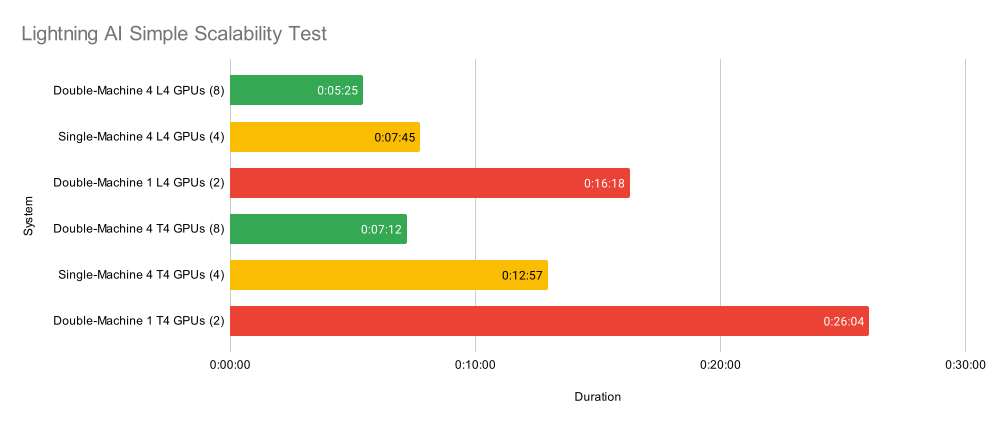

# Poverty Forecasting in Peru

## Introduction

Satellite Images possess immense power to address many societal problems. Recently in Peru, many clandestine airstrips for drugs were found disrupting the forestland of the country [<a href='#1'>1</a>]. On the other hand, due to satellite imagery, archaeologists were able to find over 430 unexplored Nazca geoglyphs [<a href='#2'>2</a>]. Therefore, there is an opportunity to develop Machine Learning models for the automatic classification or prediction of societal issues. In this regard, one pressing issue in Peru is poverty. Recent literature suggest the power of satellite imagery for predicting assets index, a reliable indicator of development [<a href='#3'>3</a>].

## Problem

One of the mayor problems of Machine Learning, specially Deep Learning, is the insufferable amount of trainable parameters. There is a need for training Deep Learning models in multiples machines with multiple hardware accelerators such as TPUs, or GPUs. 

## Proposal

As a consequence, many cloud computer providers are offering excellent services for developing machine learning models. In this broad realms of services, one remarkable for machine learning research is Lightning AI.

## Results

Lightning AI was tested on different system configurations. We measured the training time of the DenseNet-121 with the CIFAR10 dataset on single and double system with 1 or 4 GPUs each. 

As a result, Lightning AI seems to use modern computing techniques for assuring a fast and reliable training with unnoticeable communication latency.

## Conclusions

- Deep Learning models are expensive to instruct, requiring cloud providers services to address the hardware exigency.

- Distributed and Parallel training is key for the development of Deep Learning models. 

- Containerizing models offers execution consistently across various computing environments.

## References

[<a id='1'>1</a>] Mayra, “Concesiones de alto vuelo: pistas de aterrizaje clandestinas y cultivos de coca invaden tierras forestales de Ucayali,” Noticias Ambientales, Nov. 12, 2024. https://es.mongabay.com/2024/11/concesiones-de-alto-vuelo-pistas-de-aterrizaje-clandestinas-y-cultivos-de-coca-invaden-tierras-forestales-de-ucayali/

[<a id='2'>2</a>] M. Sakai et al., “AI-accelerated Nazca survey nearly doubles the number of known figurative geoglyphs and sheds light on their purpose,” Proceedings of the National Academy of Sciences, vol. 121, no. 40, Sep. 2024, doi: 10.1073/pnas.2407652121.

[<a id='3'>3</a>] O. Hall, F. Dompae, I. Wahab, and F. M. Dzanku, “A review of machine learning and satellite imagery for poverty prediction: Implications for development research and applications,” Journal of International Development, vol. 35, no. 7, pp. 1753–1768, Feb. 2023, doi: 10.1002/jid.3751.